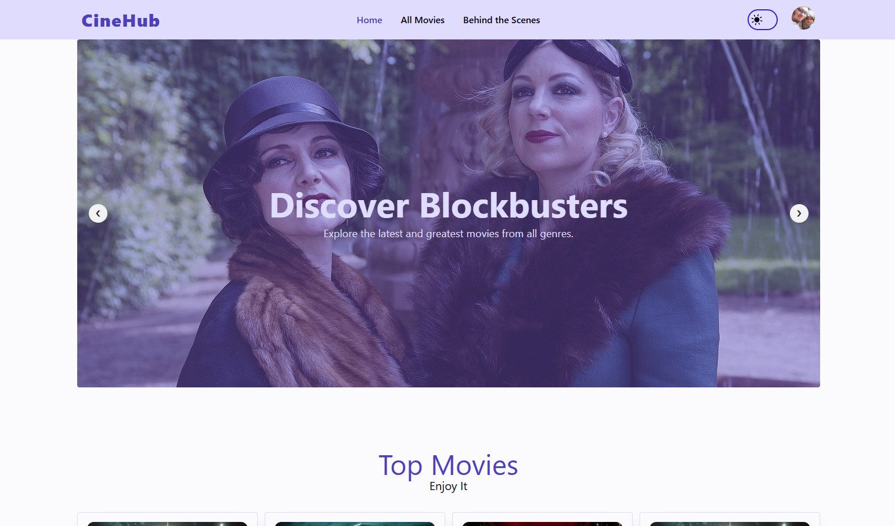

# Cinematic Sphere - Your Personalized Movie Portal



## Project Description

Cinematic Sphere is a user-friendly Movie Portal designed to simplify the process of exploring, managing, and enjoying movies. With a focus on a dynamic user interface and seamless experience, the portal allows users to browse a vast collection, view detailed information, manage their favorite films, and even contribute by updating movie details (depending on permissions). The application features a toggleable light and dark mode for personalized viewing comfort.

## Features

* **Explore Movies:** Browse a curated collection of movies with intuitive search and filtering options.
* **Movie Details:** View comprehensive information for each film, including synopsis, cast, crew, ratings, trailers, and more.
* **User Authentication:** Securely sign up and log in to manage personalized features.
* **Favorite Movies:** Users can easily add and remove movies from their personal favorites list.
* **Update Movie Details:** Functionality for authorized users to update existing movie information.
* **Dynamic UI:** Responsive design ensures a great experience on various devices.
* **Light & Dark Mode:** Toggle between distinct visual themes for comfortable viewing in any environment.
* **Seamless User Experience:** Smooth transitions, clear feedback, and easy navigation.

## Technologies Used

This project is built using a modern web development stack, leveraging the following key technologies and libraries:

* **Frontend Framework:** React.js
* **Build Tool:** Vite
* **UI Library:** Mantine
* **Styling:** Tailwind CSS, DaisyUI, PostCSS, Autoprefixer
* **Routing:** React Router DOM
* **State Management / Data Fetching:** TanStack Query (React Query)
* **API Communication:** Axios
* **Backend (Authentication & Data Storage):** Firebase
* **Forms:** React Hook Form
* **Icons:** React Icons
* **Animations:** Motion
* **Carousels:** Swiper (with react-id-swiper)
* **Loading Indicators:** React Loader Spinner
* **Rating Component:** React Simple Star Rating
* **Alerts/Notifications:** SweetAlert2
* **Date Utilities:** date-fns
* **List Utilities:** match-sorter, sort-by
* **Offline Storage (Optional):** localforage
* **Charting (Optional):** Recharts (@mantine/charts uses Recharts)

## Installation

To get a local copy up and running, follow these simple steps.

### Prerequisites

* Node.js installed (v14 or higher recommended)
* npm or yarn or pnpm package manager

### Steps

1.  **Clone the repository:**
    ```bash
    git clone <repository_url>
    cd cinematic-sphere
    ```
    *(Replace `<repository_url>` with the actual URL of your GitHub repository)*

2.  **Install dependencies:**
    ```bash
    npm install
    # or
    yarn install
    # or
    pnpm install
    ```

3.  **Set up Firebase:**
    * Create a new project in the [Firebase Console](https://console.firebase.google.com/).
    * Set up Firebase Authentication (e.g., Email/Password) and potentially Firestore or Realtime Database depending on how you store movie and favorite data.
    * Create a `.env` file in the root of your project directory.
    * Add your Firebase configuration details to the `.env` file:
        ```env
        VITE_FIREBASE_API_KEY=YOUR_FIREBASE_API_KEY
        VITE_FIREBASE_AUTH_DOMAIN=YOUR_FIREBASE_AUTH_DOMAIN
        VITE_FIREBASE_PROJECT_ID=YOUR_FIREBASE_PROJECT_ID
        VITE_FIREBASE_STORAGE_BUCKET=YOUR_FIREBASE_STORAGE_BUCKET
        VITE_FIREBASE_MESSAGING_SENDER_ID=YOUR_FIREBASE_MESSAGING_SENDER_ID
        VITE_FIREBASE_APP_ID=YOUR_FIREBASE_APP_ID
        VITE_FIREBASE_MEASUREMENT_ID=YOUR_FIREBASE_MEASUREMENT_ID # Optional
        ```
      *(Replace `YOUR_FIREBASE_...` with your actual credentials from the Firebase project settings)*


## Running the Project

1.  **Start the development server:**
    ```bash
    npm run dev
    # or
    yarn dev
    # or
    pnpm dev
    ```

2.  Open your web browser and visit `http://localhost:5173` (or the port indicated in your terminal).

## Project Structure (Example)